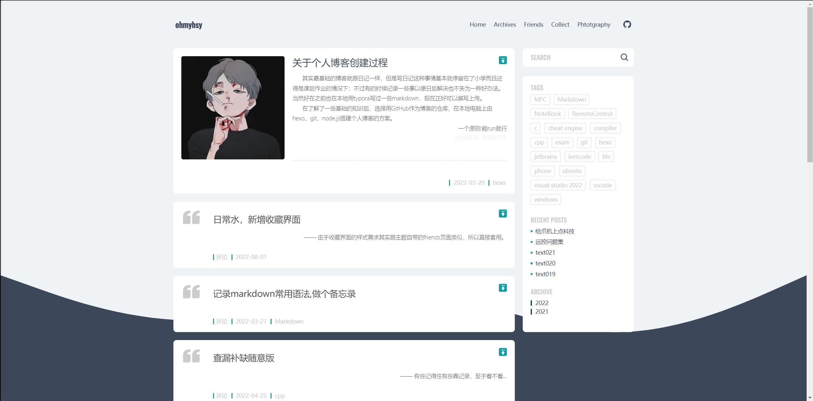

# 以下为个人博客简介

工具包含：
1. hexo
2. node.js
3. github
4. git bash
5. vscode

---
- Aomori主题demo: [戳此处](https://linhong.me/)
- Aomori主题项目地址: [戳此处](https://github.com/lh1me/hexo-theme-aomori)

> 比较精简干练，个人修改成度小

---
- Butterfly主题demo: [戳此处](https://butterfly.js.org/)
- Butterfly主题项目地址: [戳此处](https://github.com/jerryc127/hexo-theme-butterfly)

> 功能强大，花里胡哨哈哈，玩法比较多
